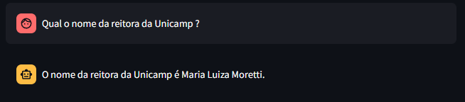
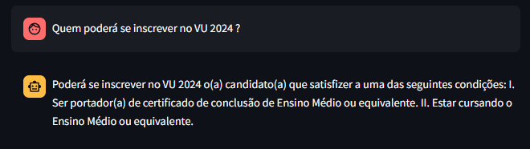
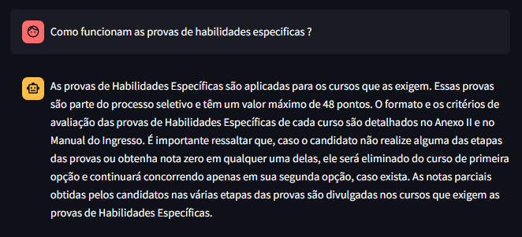
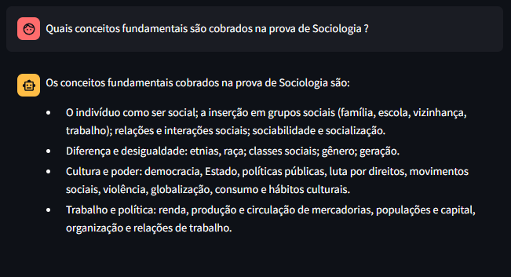
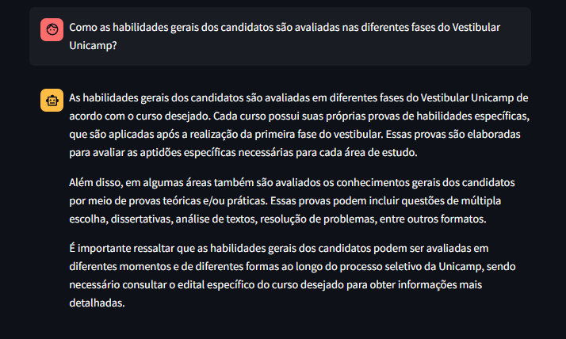
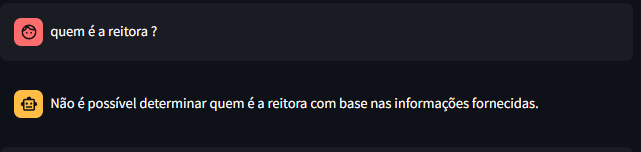
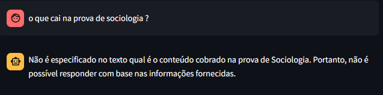

# Assistente Virtual Unicamp
Chatbot baseado em RAG (Retrieval Augmented Generation) usando a API GPT3.5 ou similar como agente inteligente para responder a perguntas sobre o Vestibular Unicamp 2024, abaixo segue o relatório com informações sobre Implementação (bibliotecas e funções utilizadas para o projeto), Avaliação (testes manuais para analisar a precisão do projeto), Instalação e execução (mini guia para execução do projeto localmente)   

## Implementação 
### Bibliotecas Utilizadas
- PyPDF2 - Biblioteca em Python utilizada para manipulação de arquivos PDF, sendo utilizado para extrair dados do Edital Unicamp 2023, possibilitando a utilização das informações de maneira estruturada e adaptada;
- Streamlit - Biblioteca Python que simplifica a criação de interfaces web, foi escolhido para criar as telas da aplicação, e facilitar a interação do usuário;
- Langchain - Framework open source projetado para o desenvolvimento de aplicações alimentados por modelos de linguagem, na aplicação, ele junto ao modelo GPT-3.5-turbo foram utilizados para a compreenção dos dados fornecidos no PDF e para formar as repostas recebidas dos usuários;

### Funções utilizadas
- Langchain
  - [RecursiveCharacterTextSplitter](https://python.langchain.com/docs/modules/data_connection/document_transformers/text_splitters/recursive_text_splitter) - Divisor de texto fornecido pelo Langchain, recebe um texto de grande volume (texto extraído do PDF) e o separa em pedaços menores, tentando manter os parágrafos, frases e palavras juntos o máximo possivel;
  - [ConversationSummaryMemory](https://python.langchain.com/docs/modules/memory/types/summary) - Utilizado para criar um "compilado" da conversa gerada com o modelo, se torna util em conversas mais longas quando existe um grande acumulo de informações com o Chatbot;
  - [ConversationalRetrievalChain](https://api.python.langchain.com/en/latest/chains/langchain.chains.conversational_retrieval.base.ConversationalRetrievalChain.html) - "Cadeira" de informações para montar uma conversa com base nos documentos, recebe o histórico do chat (uma lista de mensagens do usuário e as respostas do modelo) junto com as novas perguntas, o modelo com base nisso retorna uma resposta para a ultima pergunta gerada. 

## Avaliação
Abaixo seguem algumas perguntas utilizadas para validação do projeto com base na sua capacidade de absorver os dados que foram extraidos do PDF
- Qual o nome da reitora da Unicamp ?  
  
- Quem poderá se inscrever no VU 2024 ?  
  
- Como funcionam as provas de habilidades especificas ?  
  
- Quais conceitos fundamentais são cobrados na prova de Sociologia ?  
  
- Como as habilidades gerais dos candidatos são avaliadas nas diferentes fases do Vestibular Unicamp?  
  

`OBS: Durante os testes foi notado a dificuldade do modelo em responder perguntas mais avulsas, perguntas genéricas e prompts pouco elaborados. Esses acabavam não tendo uma resposta adequada para as perguntas realizadas`  
- Quem é a reitora ?  
  
- O que cai na prova de sociologia ?  
  

## Instalação e execução
Para execução do projeto localmente foi utilizado uma virtual environment (venv) para isolar e gerenciar os pacotes e suas versões de forma independente, caso não tenha em sua maquina instale com o comando 
`````python                      
# Clone o repositório do projeto 
git clone https://github.com/gilbertomoj/rag-based-unicamp-chatbot.git
# Criação do ambiente virtual
python -m venv venv 
# Ativação do ambiente virtual no Windows / Linux / MacOS
./venv/Scripts/Activate (Windows) | source venv/Scripts/Activate (Linux ou MacOS) 
# Instalação das bibliotecas 
pip install -r requirements.txt
# Criação do arquivo .env (pode apenas renomear o .env.example) e a criação da variável com a key
OPENAI_API_KEY="SUA KEY" # Sem as aspas !
# Execução do do projeto
streamlit run main.py
`````
## Deploy


